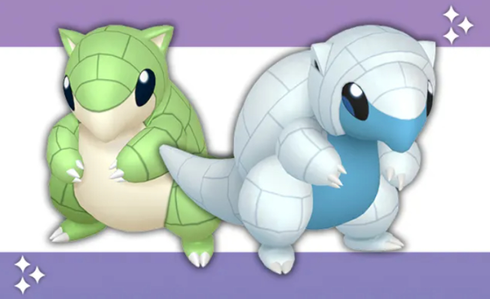
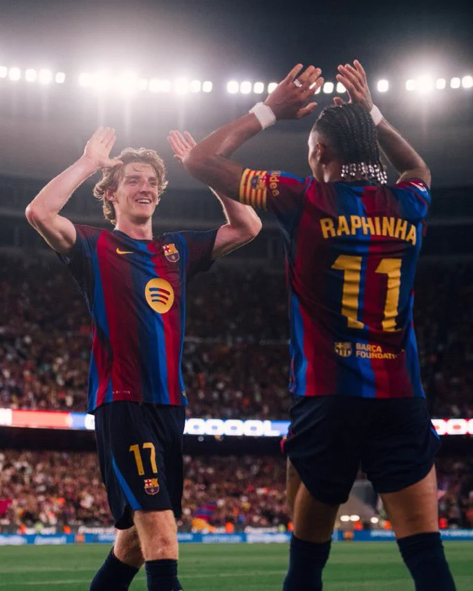
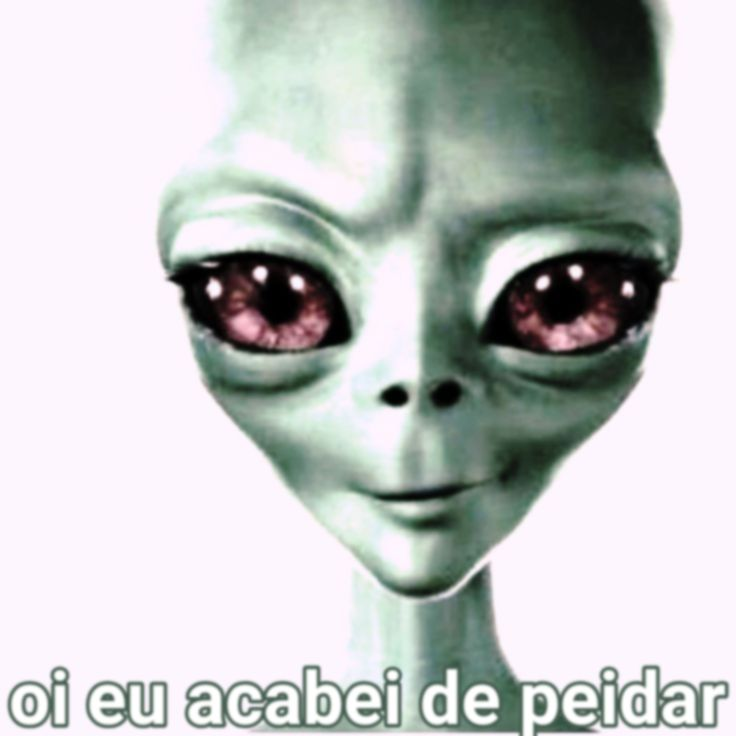
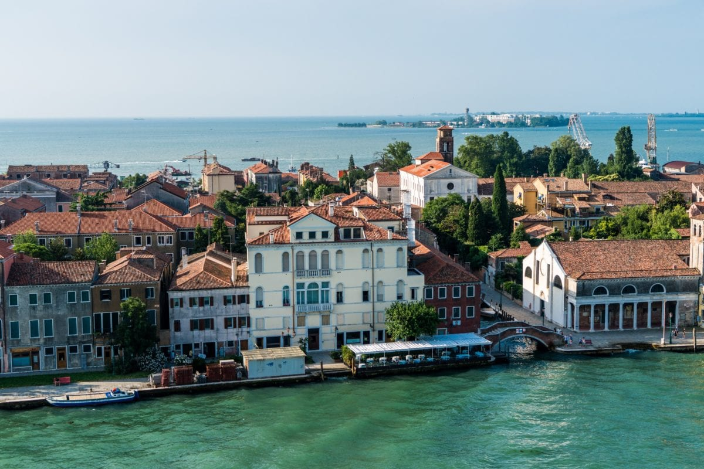

<h1>Por Gentileza não Leve esse Readme a Serio</h1>

## Sand Sand Sand Shrew 

 
 
 

---
___

  
Aqui é o Inferno , não Abra

## Você Gosta de Gordinha????
>A Dupla Gordon + Raphinha

<h3>esses caba são bons </h3>

 
 
 

---
___

<h1>
Primeira impressão, cê não sobe  
Segundo lugar também é forte  
Terceiro, Guzma também pode  
E quarto, que você não peita A PORR@ DO GOLISOPOD
</h1>

<h3>Golisopod Top 2</h3>
<h6>Só Atrás do Sandshrew </h6>

 
 
 

---
___

<h1>Eles Estão de Oio em Nois</h1>
<h6>Aleska Peidou</h6>

---
___

Mi rendo conto del valore di un amico. 
Anche se è un fallimento, il suo odore mi fa ancora male. 
Sapore di dolore, come una rosa piena di spine: la felicità è stata lasciata alle spalle. 
Innamorato delle spine, cerco di sopportare il dolore che mi stringe il cuore; non so se ci riuscirò. 
Notte, notte, notte... forse notte, se sei vivo. 
Cerco di essere buono, ma quando respiro non riesco a smettere di soffrire. 
Voglio vivere di nuovo. Notte, notte, notte. 
Ho provato a essere la luce, ma vivo nell'ombra del vuoto. 
Notte, notte, notte... mi ha detto che potevo vivere. 
Notte, notte, notte. 
La rosa spinosa mi ha portato nell'abisso, e nell'abisso ho trovato la mia casa. 
Il fuoco non mi brucia più. 
Ho scambiato la luce del mondo con l'oscurità dell'abisso. 
Indossavo la maschera di qualcuno che non sono. 
Mi hanno detto che, se alla fine potessi essere felice, allora ne sarebbe valsa la pena, ma ora non credo che ci sarà una fine del genere. 
Cadde la corona del Re, la città bruciò in fiamme, i cittadini urlarono. 
Le fiamme bruciarono molto più delle persone e della città. 
Le fiamme bruciano, lasciando solo le ombre di ciò che quelle persone erano. 
Un addio casuale. 
Un piano per un futuro che non è mai iniziato. 
Un nuovo inizio impossibile. 
Le domande non hanno risposta, ma pesano come una vita intera. 
Ce l'ho solo ora. 
Non mi vedo più. 
Ho provato a scappare, ma non ci riesco. 
Ogni volta che apro gli occhi, tutto inizia e finisce allo stesso modo.

---
___

<h1>Ate mais Baby</h1>
<h6>Graças a Deus esse é o fim do Readme</h6>

